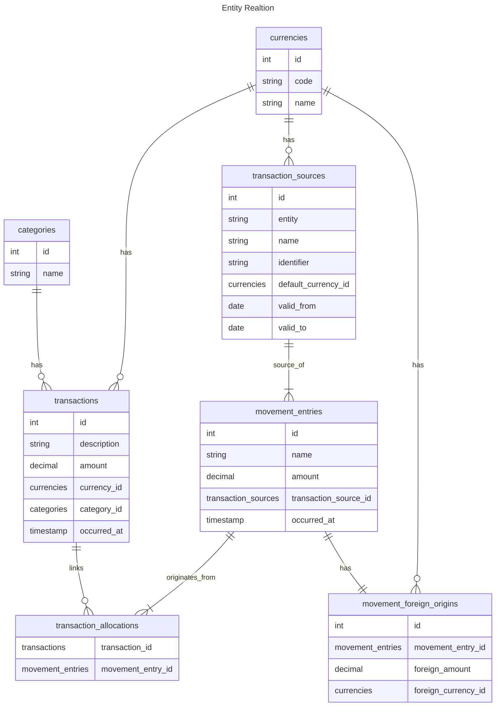

```mermaid
---
title: Entity Realtion
---
erDiagram
    transactions ||--o{ transaction_allocations : links
    categories ||--o{ transactions : has
    currencies ||--o{ transactions : has
    movement_entries ||--|{ transaction_allocations : originates_from
    movement_entries ||--|| movement_foreign_origins : has
    currencies ||--o{ movement_foreign_origins : has
    transaction_sources ||--|{ movement_entries : source_of
    currencies ||--o{ transaction_sources : has

    transactions {
        int id
        string description
        decimal amount
        currencies currency_id
        categories category_id
        timestamp occurred_at
    }
    movement_entries {
        int id
        string name
        decimal amount
        transaction_sources transaction_source_id
        timestamp occurred_at
    }
    movement_foreign_origins {
        int id
        movement_entries movement_entry_id
        decimal foreign_amount
        currencies foreign_currency_id
    }
    transaction_allocations {
        transactions transaction_id
        movement_entries movement_entry_id
    }
    categories {
        int id
        string name
    }
    currencies {
        int id
        string code
        string name
    }
    transaction_sources {
        int id
        string entity
        string name
        string identifier
        currencies default_currency_id
        date valid_from
        date valid_to
    }
```
