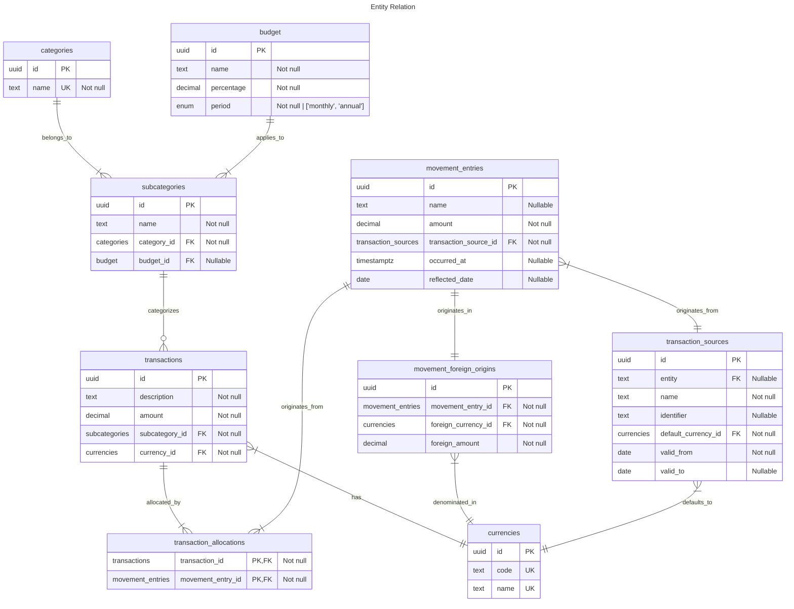

```mermaid
---
title: Entity Relation
---
erDiagram
    categories ||--|{ subcategories : belongs_to
    subcategories ||--o{ transactions : categorizes
    budget ||--|{ subcategories : applies_to
    transactions ||--|{ transaction_allocations : allocated_by
    transactions }|--|| currencies : has
    movement_entries ||--|{ transaction_allocations : originates_from
    movement_entries ||--|| movement_foreign_origins : originates_in
    movement_foreign_origins }|--|| currencies : denominated_in
    movement_entries }|--|| transaction_sources : originates_from
    transaction_sources }|--|| currencies : defaults_to

    transactions {
        uuid id PK
        text description "Not null"
        decimal amount "Not null"
        subcategories subcategory_id FK "Not null"
        currencies currency_id FK "Not null"
    }
    movement_entries {
        uuid id PK
        text name "Nullable"
        decimal amount "Not null"
        transaction_sources transaction_source_id FK "Not null"
        timestamptz occurred_at "Nullable"
        date reflected_date "Nullable"
    }
    movement_foreign_origins {
        uuid id PK
        movement_entries movement_entry_id FK "Not null"
        currencies foreign_currency_id FK "Not null"
        decimal foreign_amount "Not null"
    }
    transaction_allocations {
        transactions transaction_id PK, FK "Not null"
        movement_entries movement_entry_id PK, FK "Not null"
    }
    categories {
        uuid id PK
        text name UK "Not null"
    }
    subcategories {
        uuid id PK
        text name "Not null"
        categories category_id FK "Not null"
        budget budget_id FK "Nullable"
    }
    budget {
        uuid id PK
        text name "Not null"
        decimal percentage "Not null"
        enum period "Not null | ['monthly', 'annual']"
    }
    currencies {
        uuid id PK
        text code UK
        text name UK
    }
    transaction_sources {
        uuid id PK
        text entity FK "Nullable"
        text name "Not null"
        text identifier "Nullable"
        currencies default_currency_id FK "Not null"
        date valid_from "Not null"
        date valid_to "Nullable"
    }
```
