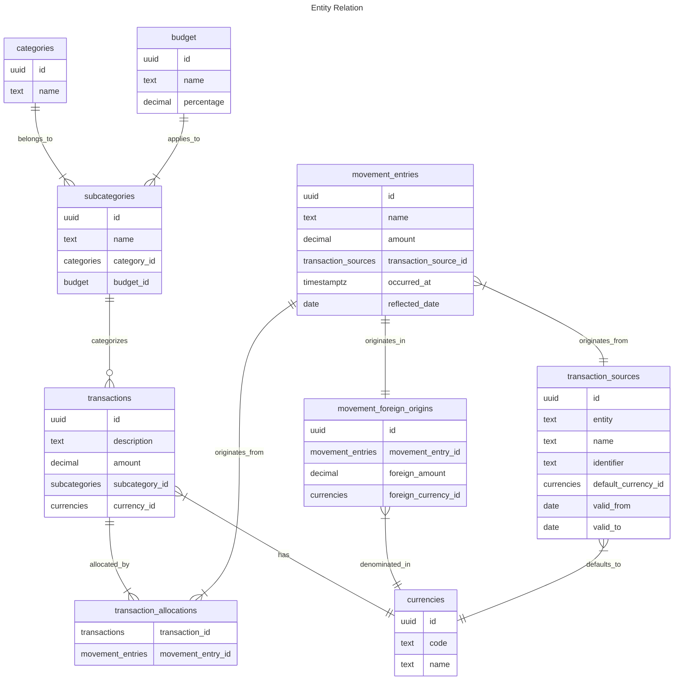

```mermaid
---
title: Entity Relation
---
erDiagram
    categories ||--|{ subcategories : belongs_to
    subcategories ||--o{ transactions : categorizes
    budget ||--|{ subcategories : applies_to
    transactions ||--|{ transaction_allocations : allocated_by
    transactions }|--|| currencies : has
    movement_entries ||--|{ transaction_allocations : originates_from
    movement_entries ||--|| movement_foreign_origins : originates_in
    movement_foreign_origins }|--|| currencies : denominated_in
    movement_entries }|--|| transaction_sources : originates_from
    transaction_sources }|--|| currencies : defaults_to

    transactions {
        uuid id
        text description
        decimal amount
        subcategories subcategory_id
        currencies currency_id
    }
    movement_entries {
        uuid id
        text name
        decimal amount
        transaction_sources transaction_source_id
        timestamptz occurred_at
        date reflected_date
    }
    movement_foreign_origins {
        uuid id
        movement_entries movement_entry_id
        decimal foreign_amount
        currencies foreign_currency_id
    }
    transaction_allocations {
        transactions transaction_id
        movement_entries movement_entry_id
    }
    categories {
        uuid id
        text name
    }
    subcategories {
        uuid id
        text name
        categories category_id
        budget budget_id
    }
    budget {
        uuid id
        text name
        decimal percentage
    }
    currencies {
        uuid id
        text code
        text name
    }
    transaction_sources {
        uuid id
        text entity
        text name
        text identifier
        currencies default_currency_id
        date valid_from
        date valid_to
    }
```
